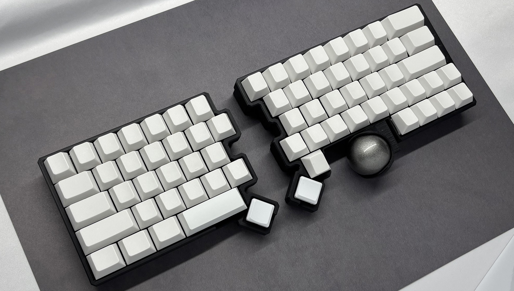
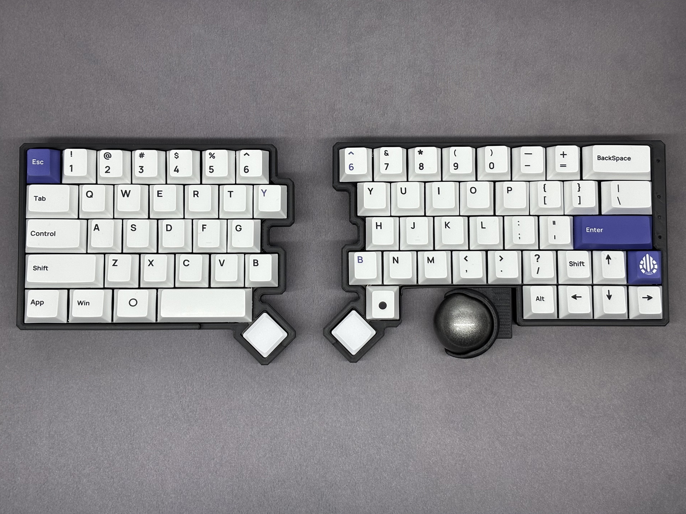
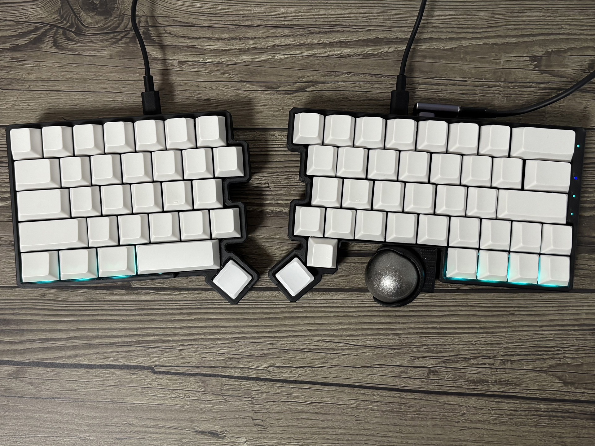
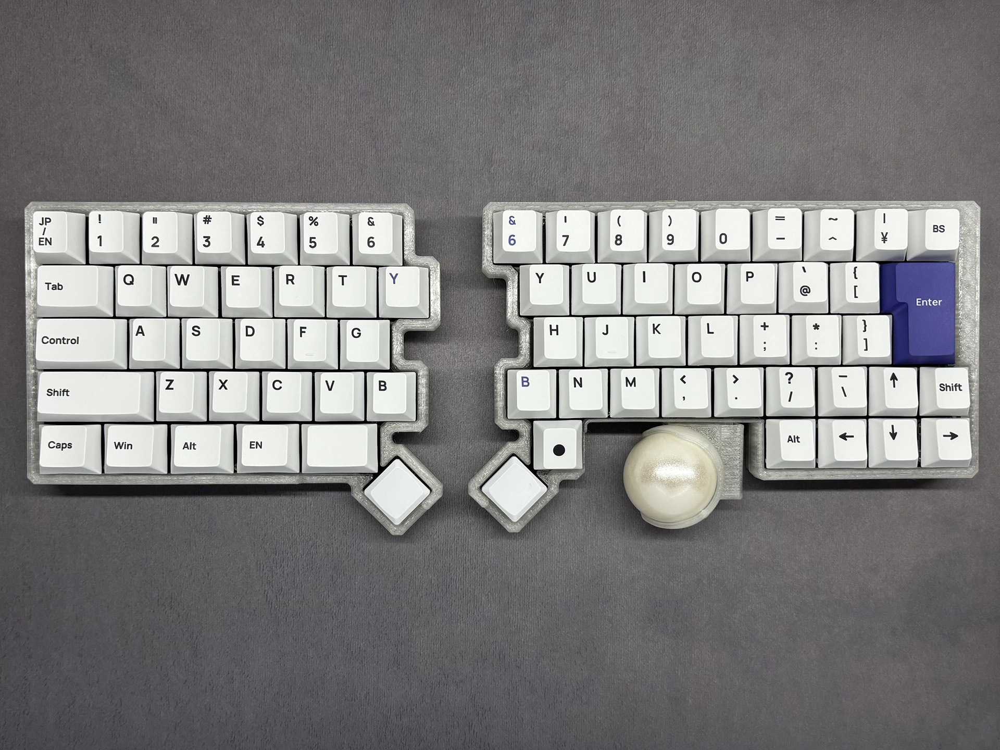
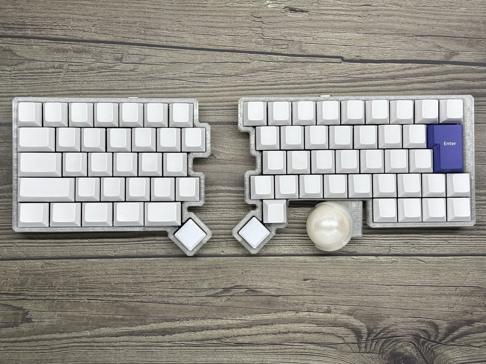

#  DYA Split Keyboard

## Features

- Controller: RP2040-zero (QMK) and XAIO NRF52840 plus (ZMK)
  - ZMK farmware is not available yet, since XAIO NRF52840 plus cannot be used in Japan for now.
- Layout: US and JIS
- Switch: Cherry MX compatible, hotswappable
- LED x 12 (left 4, right 4 + 4 indicator)
- PMW3610 low power trackball sensor
- Optional features by soldering additional parts
  - Lipo battery support for XAIO
  - AAA battery (1.2V NiMH or 1.5V) support

## Build Guide

[V1.0 部品取り付け済み基板（日本語）](./hardware/dya-v1/build-guide/pcba/Readme-ja.md)

## Gallery

- Keycap: [acid-caps](https://keeb-on.com/collections/acid-caps) or no-brand white cap
- Trackball: 34mm

### US Layout setup

#### LED decoration and indicators

### JIS Layout setup

## Shop

Coming soon... in https://cormoran707.booth.pm/

## License

- QMK firmware (./farms/qmk_farmware/\*): Inherits its license. Majority of them are under GPLv2. See its own repository.
- DYA logo  (./img/dya.svg): All rights reserved.
- Other keyboard pictures under ./img: CC BY
- Hardware
  - kicad library (./hardware/kicad_library/\*) and sch (\*.kicad_sch): MIT
  - PCB (\*.kicad_pcb): CC BY-NC
  - Case data (\*.stl): CC BY
