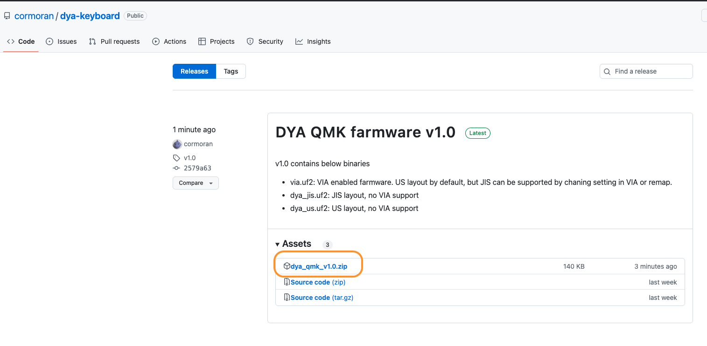
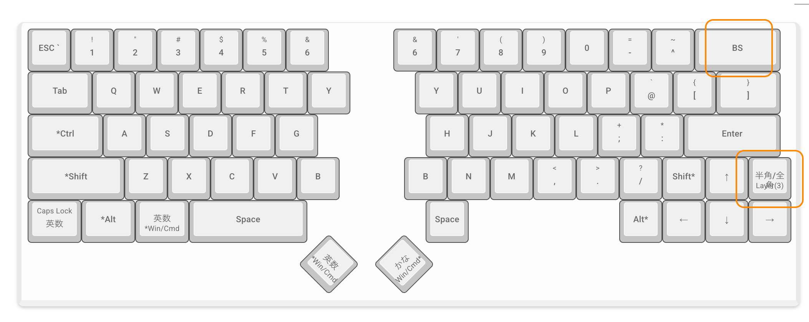
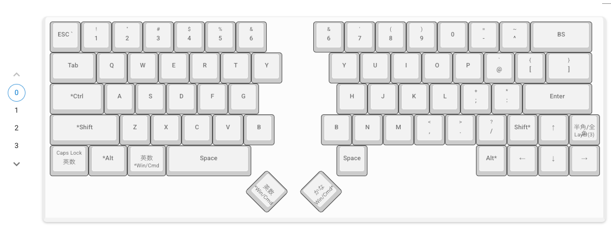
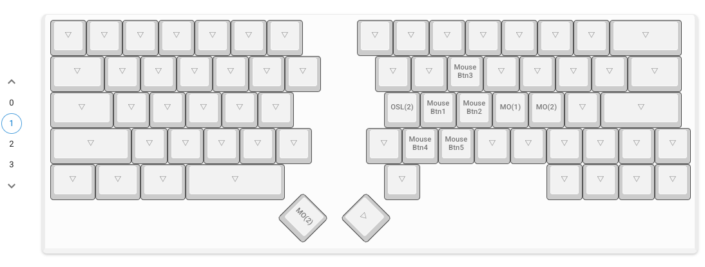
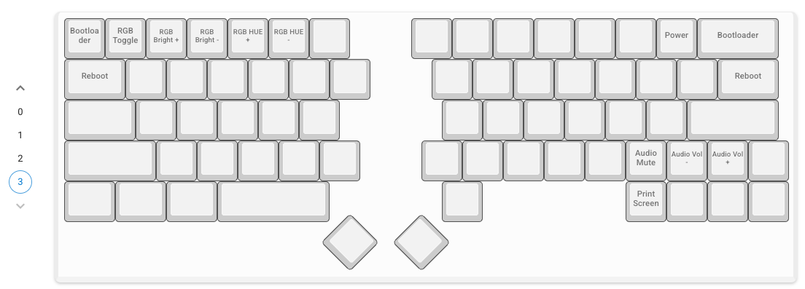
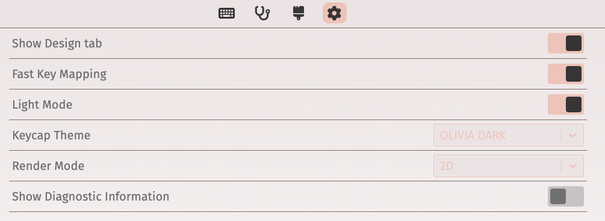
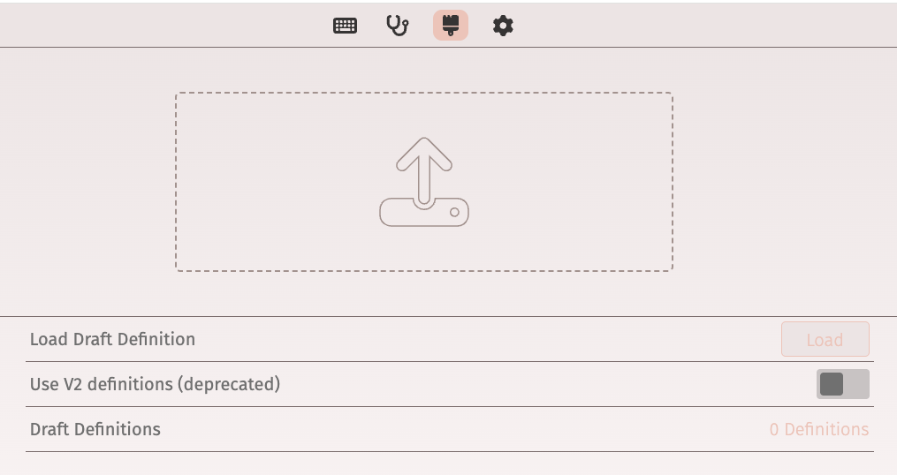
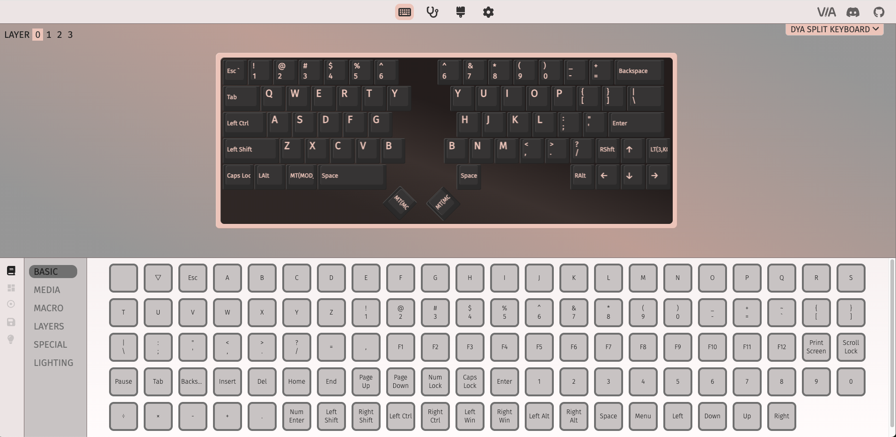
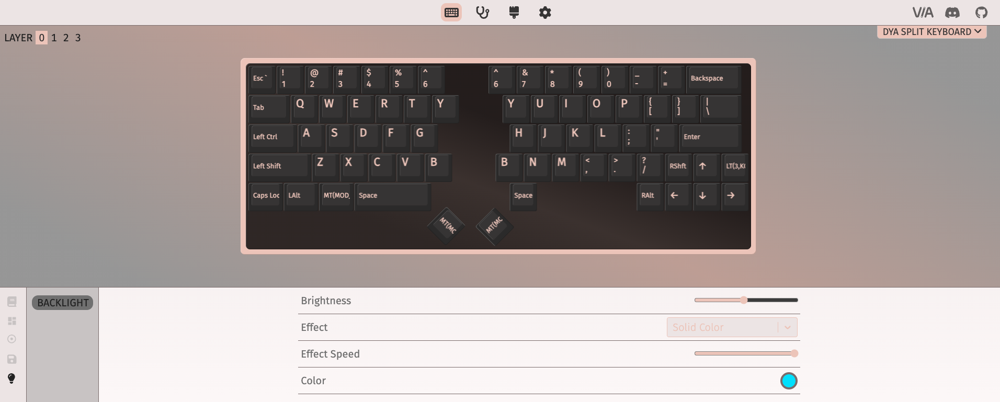

#  DYA v1.0 ファームウェアガイド

https://cormoran707.booth.pm/items/6705756 で配布中のキット向けのファームウェア書き込み/改造ガイドです。

## ファームウェア書き込み手順

1. [こちらのページ](https://github.com/cormoran/dya-keyboard/releases) から最新版のファームウェア（zip ファイル）をダウンロードしてください

2. RP2040-zero を PC に接続します

3. RP2040-zero の Boot スイッチと Reset スイッチを同時に押して、Reset スイッチ → Boot スイッチの順で離します。RP2040 がブートモードに入って PRI-PR2 という名前で USB メモリのようにデバイスが PC と接続されます。

   一度ファームウェアを書き込むと、キーボード組み立て後は右下から上に２番目のキーを押しながら Backspace キーを押すことでブートモードに入れるようになります。左右を接続した状態で左側の RP2040 を PC に接続していれば、この手順で左側もファームを更新できます。

4. 1 で解答したディレクトリに含まれるファームウェアファイルを USB メモリに移動させる要領で PRI-PR2 にコピーします。

   - `via.uf2` は VIA/Remap 対応のファームウェアです。デフォルトは US 配列ですが、[VIA](https://www.usevia.app/) or [Remap](https://remap-keys.app/) でノーコードでキー配列を変更できます。
     VIA, Remap で必要な json ファイルは [/firmware/qmk/keybaords/dya/dyya-via.json](https://github.com/cormoran/dya-keyboard/blob/main/firmware/qmk/keyboards/dya/dya-via.json) に置いています。
   - `dya_us.uf2`, `dya_jis.uf2` は VIA 未対応の US, JIS 配列ファームウェアです。
   - デフォルトの配列は Mac で使用することを想定した配列になっています。Windows ユーザーの方は VIA 対応ファームウェアをインストールして自分好みに設定を変更してみてください。

## デフォルトの配列

デフォルトでは４つのレイヤーが定義されています

### layer0: デフォルト

左右親指は日本語/英語入力を切り替えるために Mac の英かな + long press で Cmd が割り当てられています。

Windows 向けの便利な配列は気が向いたらそのうち考えます。要望が強ければ教えてください。

### layer1: トラックボールを動かした時に有効化されるレイヤー

トラックボールを動かすと自動で有効化されて、動かすのをやめると一定時間後に無効化されるレイヤーです

マウスの左右クリックなどが割り当てられています

- J: 左クリック
- K: 右クリック
- L: 押している間 layer1 維持
- `;` or 左手親指: 押している間 layer2 (スクロール) に移動
- n, m: 戻る、進む

n, m の戻る/進むは間違って発動してしまうことが多いので邪魔なら VIA で上書きしてください。

### layer2: スクロールレイヤー

このレイヤーが有効な間、トラックボールはスクロールモードになります。

### layer3: 設定レイヤー

LED、ブートモードなどの設定が割り当てられたレイヤーです

右下から上に２番目のキーを押している間有効になります。

配列は以下の図を見てください。音量変更とミュートが便利です。

余っているキーが多いのでよく使うショートカットをこのレイヤーに当てはめると便利です

## VIA の使い方

1. https://www.usevia.app/settings を開いて、"Show Design tab" を ON にします

2. https://www.usevia.app/design を開いて、[/firmware/qmk/keybaords/dya/dyya-via.json](https://github.com/cormoran/dya-keyboard/blob/main/firmware/qmk/keyboards/dya/dya-via.json) をドロップします

3. キーボードを PC に接続し、https://www.usevia.app/ からキーボードに接続します

   好きなように配列をカスタマイズしてみてください

4. ひとまず LED ライトの色を変えてみると楽しいかもしれません

   VIA の一番左下のライトアイコンをクリックすると LED バックライトの設定画面に移ります。明るさや色を調整してみてください。

## remap の使い方

基本的には VIA と同じです。
キーボードを接続して、[/firmware/qmk/keybaords/dya/dyya-via.json](https://github.com/cormoran/dya-keyboard/blob/main/firmware/qmk/keyboards/dya/dya-via.json) をアップロードしてください。
現在キーボードを登録申請しているので、申請が受理されれば json ファイルのアップロードは不要になると思います。

## QMK ソースコードの書き換え

ファームウェアは、このレポジトリで管理されている DYA の設定コードと、QMK ファームウェアのソースコードを使ってビルドされています。

詳細は [Makefile](https://github.com/cormoran/dya-keyboard/blob/main/Makefile) を見てもらえるとわかると思います。

簡単に要点を書いておくと、

- https://github.com/cormoran/dya-keyboard/tree/main/firmware/qmk/keyboards/dya に QMK の keyboards 以下に入るべき DYA のソースコードがあります。細かな設定や配列の定義、PMW3610 の DYA 向けドライバが含まれています。
- `make init` するとこのレポジトリの submodule として qmk_firmware のソースコードがダウンロードされます
- `make compile` とすると、`firmware/qmk/keyboards/dya` が `firmware/qmk_firmware` 以下にコピーされて dya をターゲットにした QMK ビルドが始まります

  デフォルトでは US 配列(`KM=default`)がビルドされます。VIA 対応ビルドをするためには `make compile KM=via` と指定します

- `make flash KM=via` とすると、ブートモードで PC に接続された RP2040 にファームウェアが書き込まれます
