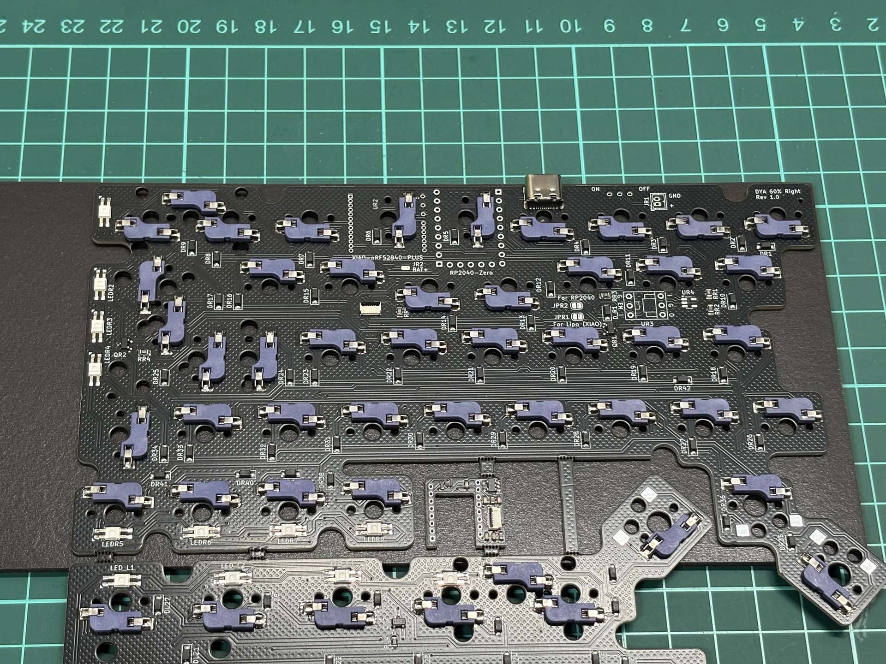
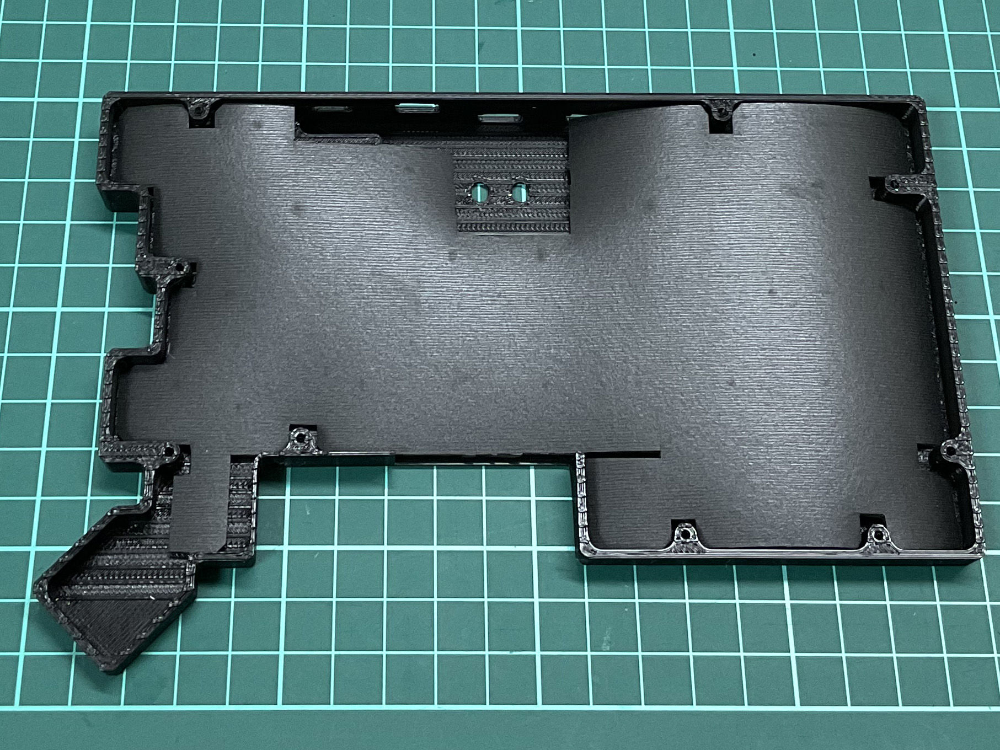
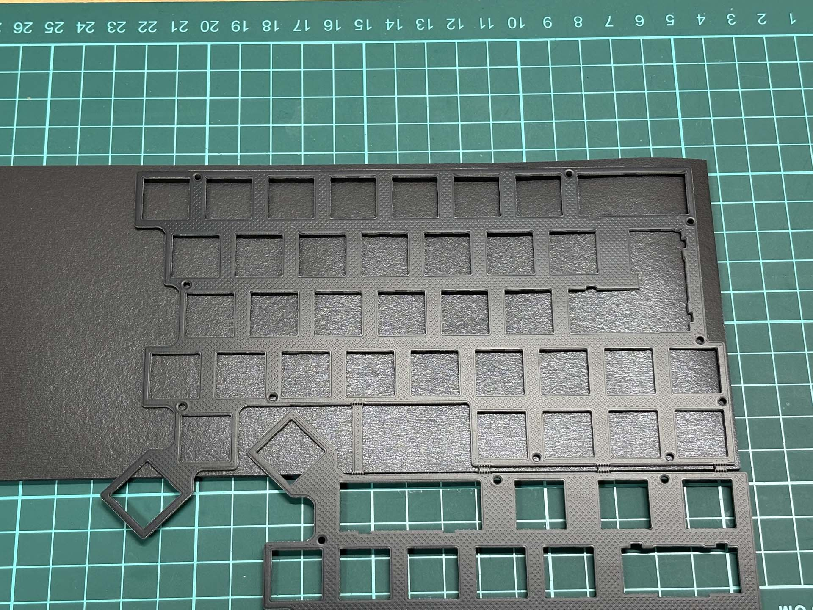
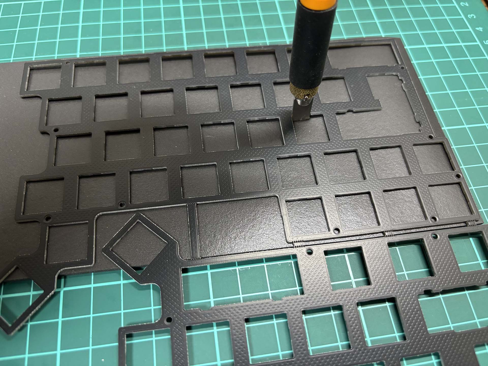
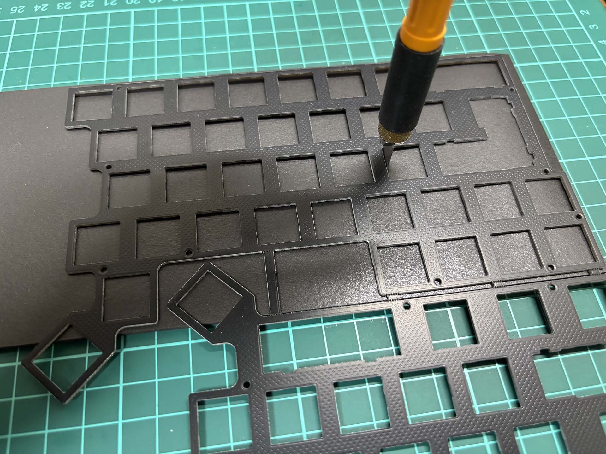
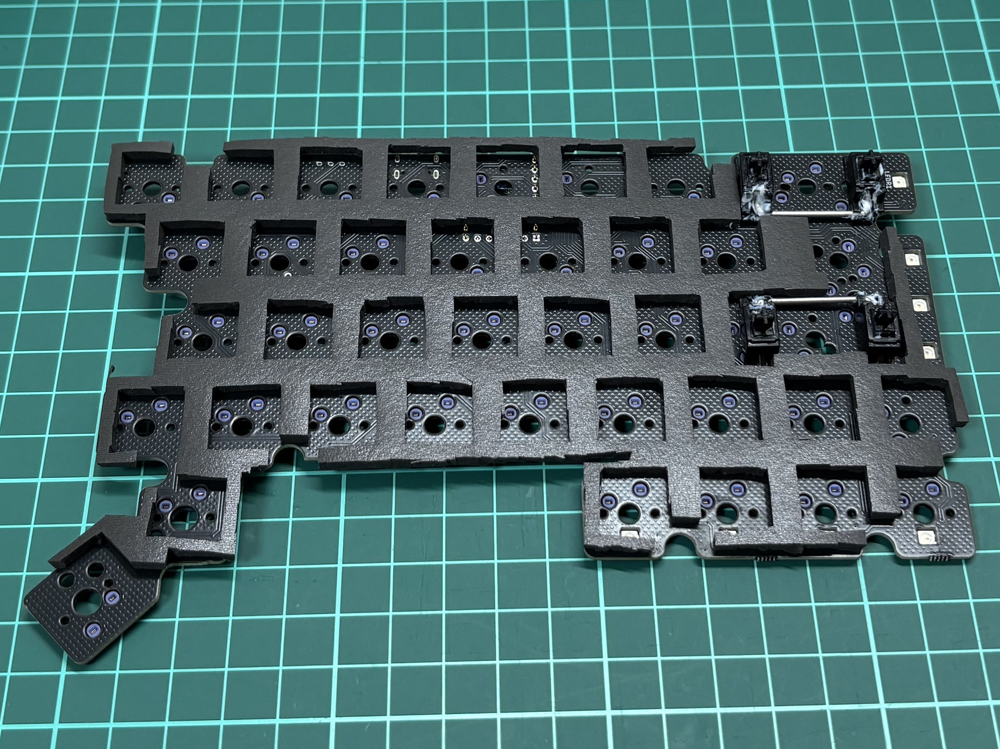
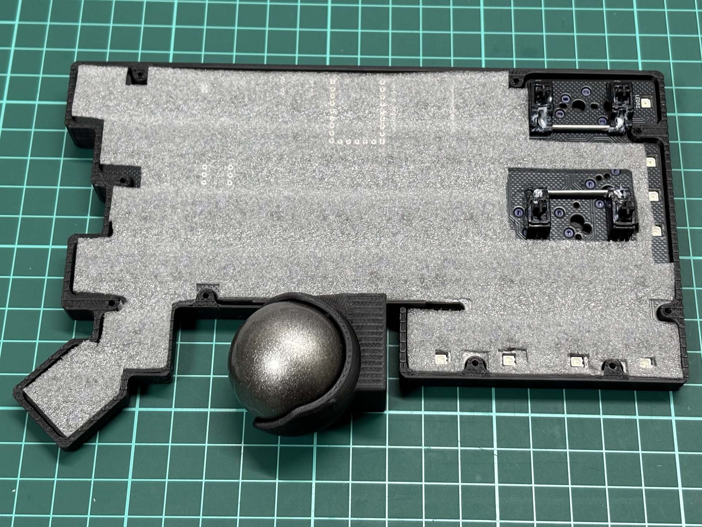

# フォームを追加して静音性と打鍵音高める

どのくらい打鍵音が変わるかはこの動画を見てください https://youtu.be/V0h9aflH_0A

## 用意するもの

- [3mm PORON シート](https://www.amazon.co.jp/%E3%82%A4%E3%83%8E%E3%82%A2%E3%83%83%E3%82%AF-%E3%83%9D%E3%83%AD%E3%83%B3%E3%82%B9%E3%83%9D%E3%83%B3%E3%82%B8%E3%83%AD%E3%83%BC%E3%83%AB-5tX100mmX1M-%E3%83%86%E3%83%BC%E3%83%97%E7%84%A1-L24-5100M/dp/B00G468722)
- [PE シート](https://www.google.com/search?q=PE%E3%82%B7%E3%83%BC%E3%83%88) (キットの基板に巻かれていた緩衝材 or 100 均の梱包材コーナーなどで入手)
- [平刃デザインナイフ](https://www.amazon.co.jp/%E3%82%AA%E3%83%AB%E3%83%95%E3%82%A1-OLFA-%E3%82%A2%E3%83%BC%E3%83%88%E3%83%8A%E3%82%A4%E3%83%95%E3%83%97%E3%83%AD%E6%9B%BF%E5%88%83-%E3%83%9A%E3%83%B3%E3%82%BF%E3%82%A4%E3%83%97%E5%9E%8B%E3%82%AB%E3%83%83%E3%82%BF%E3%83%BC-XB157N%E3%80%90%E3%82%BB%E3%83%83%E3%83%88%E8%B2%B7%E3%81%84%E3%80%91/dp/B08N6TTT2N)
  - 普通のカッターナイフで切ろうとすると切断面がボロボロになってしまいがちです。
  - 平刃ナイフを横方向に動かさずに真上から切っていくことで断面が比較的綺麗に切れます。

PORON シートはケースの反響音、振動音を抑えます（たぶん）

PE シートはスイッチの反響音を高めてくれてそうです。パチパチ系のスイッチのポテンシャルを活かすためには必須です。

## 切る

PORON シートの上に基板/トッププレートを置いてその外形に沿うように平刃のナイフで上からザクザク切っていきます。

\*ザクザク: 普通のカッターのように歯を切りたい方向に引いて切るのではなく、平刃を真上から突き刺すようにして、１回のストロークで平刃の幅分だけ切る。平刃を切りたい方向に移動させながら何度も繰り返していく。結構根気のいる作業です。

### ボトムシート

- RP2040-Zero が付く部分は目分量でカットしました。
- 画像にはありませんが、FFC ケーブルを通す穴をいい感じの場所に開けた方がケーブルの取り回しがしやすいです。

|                      |                      |                            |
| -------------------- | -------------------- | -------------------------- |
|  |  |  |

### ミドルシート

基板とトッププレートの間を埋めるシートは以下のような感じに、トッププレートの下にシートを置いて、トッププレートの外形に合わせて切っていくと良いです。

最後の写真では基板の上で直接置いていますが、次のステップで間に PE フォームが挟まります。

|                      |                      |                      |                            |
| -------------------- | -------------------- | -------------------- | -------------------------- |
|  |  |  |  |

### PE フォーム

基板と上で作ったミドルシートの間には PE フォームを引きます。
外形だけ合うようにはさみで適当にカットするだけで十分です。スイッチの穴を開ける必要はなく、このまま上からスイッチを押し込むことができます。ソケットの位置が分かりづらくなるので、**スイッチのピンの向きと穴の位置が合っているか注意しながら丁寧に押し込んでください。** スイッチのピンが曲がっていてたり、間違った向きでスイッチを押し込むと、ソケットが剥がれたりスイッチが壊れたりしてしまします。

## 組み立てる

これら３つのフォームを取り付けた状態で通常のガイドと同じように組み立てます。
3mm PORON シートは少し分厚いので、微妙にケースが閉まりきらなくなります。ネジを無理に強く締めすぎないように注意してください。
